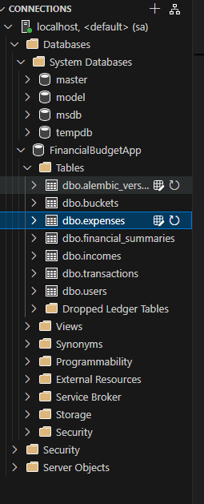
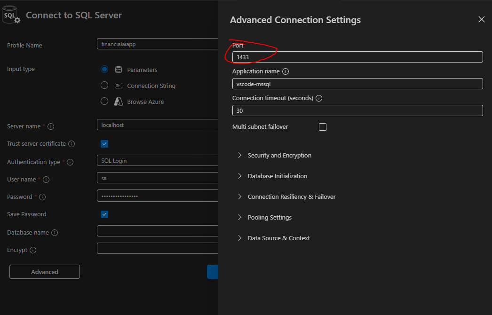

1. Create a virtual environment

```
python -m venv .venv
```

2. Activate the virtual environment

In windows: 

Powershell terminal:
```
.venv\Scripts\Activate.ps1
```

Bash terminal:
```
source .venv/Scripts/activate
```


In Linux, macOS

```
source .venv/bin/activate
```

3. Upgrading pip

```
python -m pip install --upgrade pip
```

4. Installing packages

```
pip install -r requirements.txt
```


The server will run on

127.0.0.1:8080

or

localhost:8080

NOT

0.0.0.0:8080

#

Sign up for Docker on Docker Hub

Download Docker Desktop

Download Extensions to view/modify schema:
SQL Server (mssql)

credentials



advanced credentials



Expected

