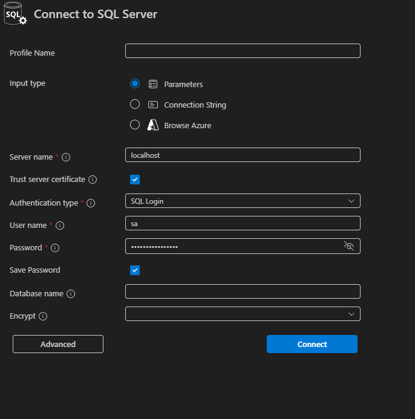

# Finance Hack API

## Getting Started

### Backend Setup

1. Create a virtual environment

```
python -m venv .venv
```

2. Activate the virtual environment

In windows: 

Powershell terminal:
```
.venv\Scripts\Activate.ps1
```

Bash terminal:
```
source .venv/Scripts/activate
```


In Linux, macOS

```
source .venv/bin/activate
```

3. Upgrading pip

```
python -m pip install --upgrade pip
```

4. Installing packages

```
pip install -r requirements.txt
```

5. Running the server

The server will run on:

```
127.0.0.1:8080
```

or

```
localhost:8080
```

NOT

```
0.0.0.0:8080
```

### Docker Setup

1. Sign up for Docker on Docker Hub
2. Download and install Docker Desktop

3. Start Docker Desktop and ensure it's running (look for the Docker icon in your system tray/menu bar)

4. Start docker compose to get the server and the backend running:
   ```
   docker compose up -d --build
   ```

### Database Setup

1. Sign up for Docker on Docker Hub
2. Download and install Docker Desktop
3. Download VS Code Extensions to view/modify schema:
   - SQL Server (mssql)

### Test Database Connection

Use these connection credentials:



For advanced configurations:


Expected result:


Database should look like:


## API Documentation

See [routes_documentation.md](routes_documentation.md) for the complete API documentation and workflow explanation.